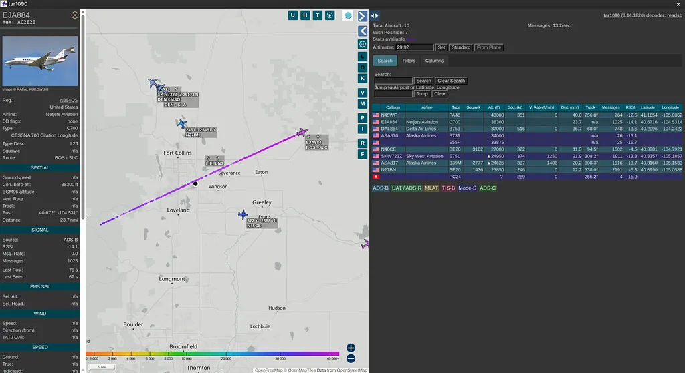
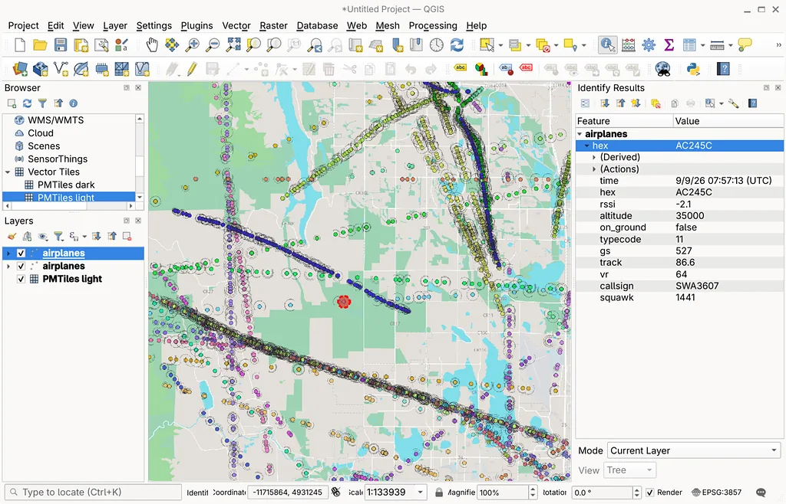
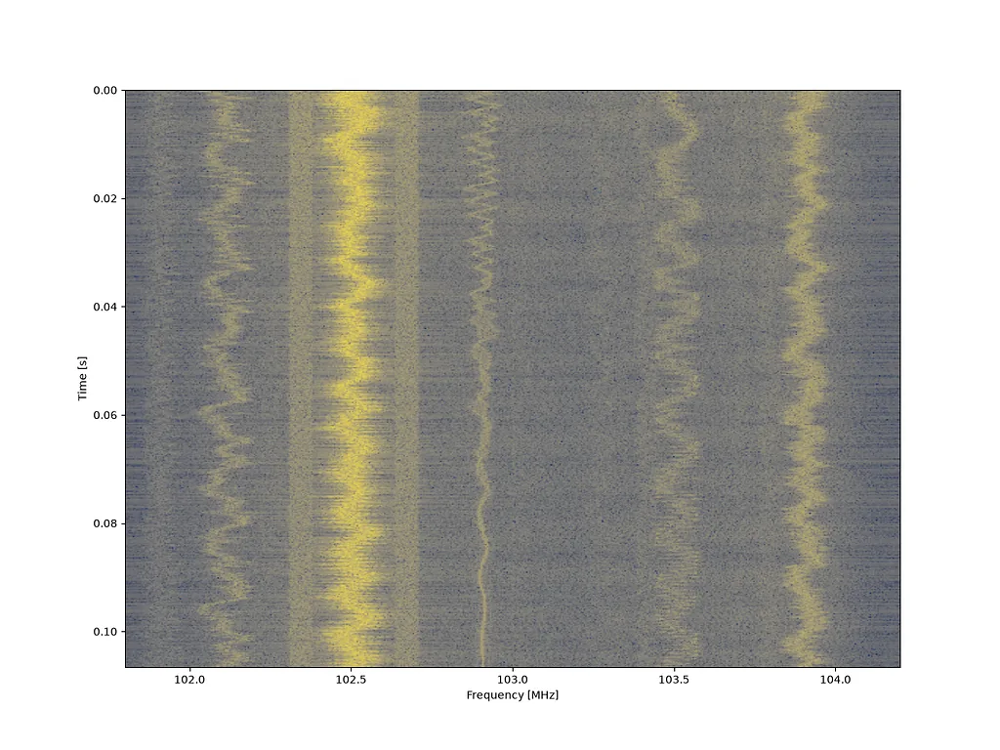

# SDR Utils

A Makefile and a few python scripts to

Decode and visualize aircraft signals (ADS-B), using `dump1090` and `tar1090` projects

Build `geojson` points from live aircraft messages
Visualizing here in qgis.

Analyze spectrograms, i.e. waterfall plots. Using `pysdr`

See `make`

    $ make
    For ADS-B aircraft signals - make dump1090|tar1090|view|aircraft
    For spectrum analysis      - make scan
